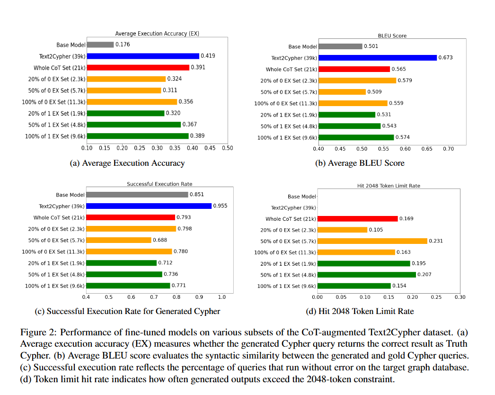

# Reason2Cypher: Enhancing Text2Cypher with Chain-of-Thought Supervision

**Reason2Cypher** is a research project that focuses on translating natural language questions into executable Cypher queries for Neo4j graph databases. The project leverages small LLMs and Chain-of-Thought (CoT) reasoning to improve the accuracy, interpretability, and robustness of query generation in structured environments.

---

## Goals

- Evaluate the effectiveness of **Chain-of-Thought reasoning** in structured graph querying.
- Build a robust dataset for the **Text-to-Cypher** task.

---

## Finetuned LoRA Adapter

👉 [LLAMA31-8B-wholeCoT](https://huggingface.co/AlecLee/LLAMA31-8B-wholeCoT)

## CoT Dataset

📊 [Reason2Cypher Dataset](https://huggingface.co/datasets/AlecLee/Reason2Cypher)

## Evaluation

Test Set come from [Text2Cypher](https://huggingface.co/datasets/neo4j/text2cypher-2024v1).

  

